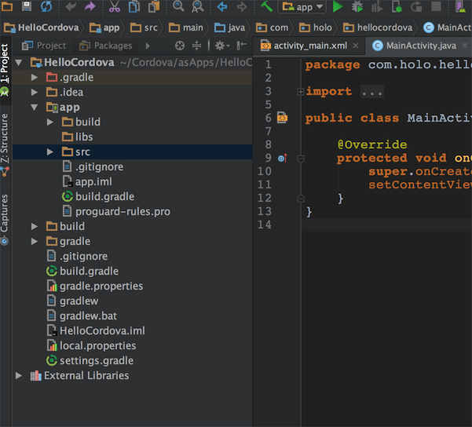
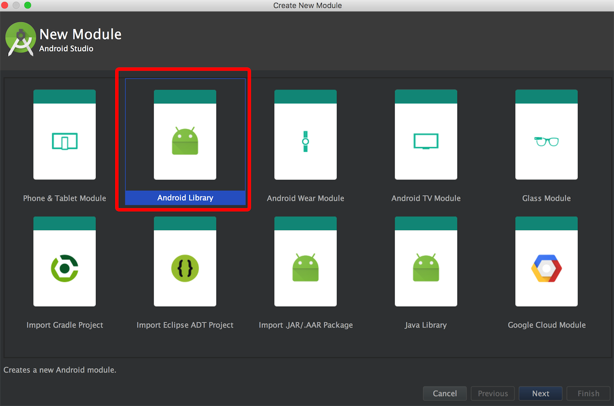
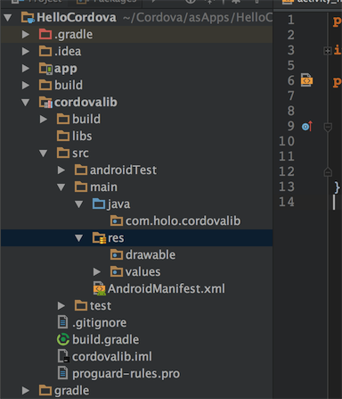
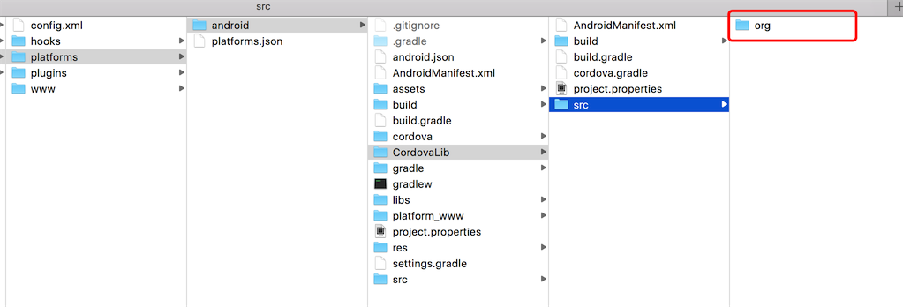
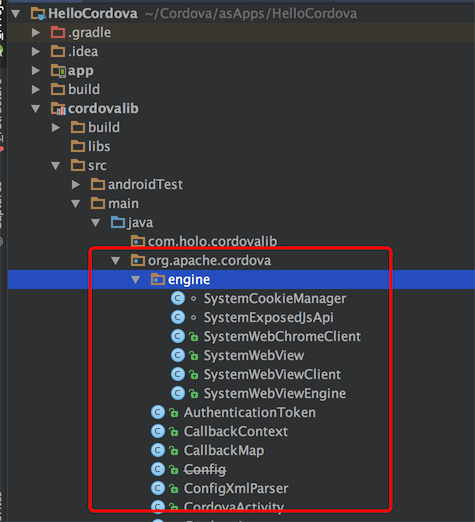
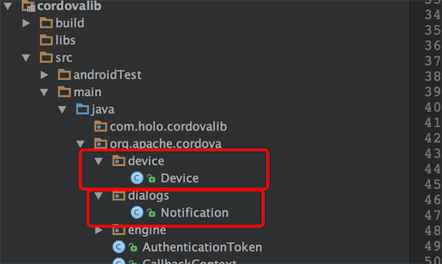
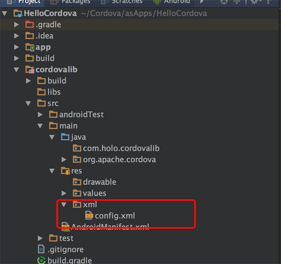
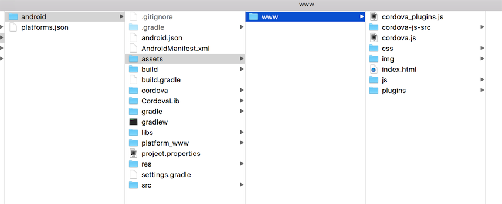
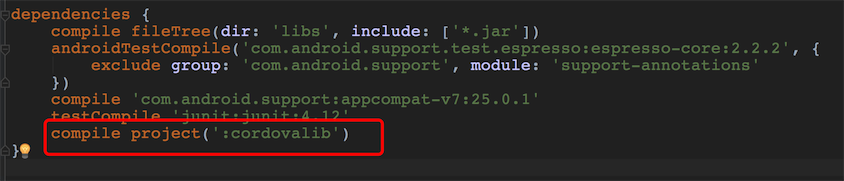
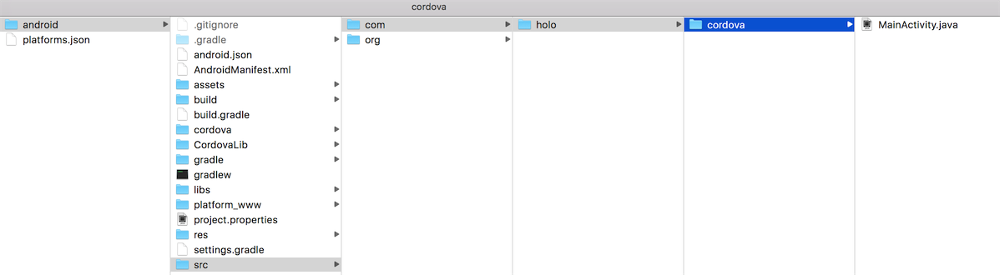

Cordova：Plugin
跟着[Cordova：HelloWord](http://kidloserme.github.io/2016/11/22/Cordova_Helloword_2016-11-22/)搞定了怎么创建一个Android项目之后，看看怎么使用Cordova的Plugin吧。
因为使用命令行创建的项目导图AS时报错，有问题，所以这里直接创建一个项目，然后将需要的文件拷贝到项目中去即可。
####1.添加插件
首先要通过cordova命令添加所需要的插件，此次测试一个比较简单的插件dialog，添加的命令`cordova plugin add cordova-plugin-dialogs`，看下图：

OK，添加成功了，从上图中可以看到进入到android/assets/www/plugins目录中已经有我们刚才添加的插件了，下面开始看怎么使用他吧。

####2.创建新工程
下面是心创建的一个全新的项目HelloCordova

####3.引入CordovaLib库
#####3.1首先创建一个Library



#####3.2拷贝CordovaLib源文件
Library创建完成后将我们需要的代码拷贝进来，要拷贝的代码在此目录下：

直接拷贝到项目中：

#####3.3拷贝Plugin源代码
Plugin的源代码在android/src目录下：

拷贝后：

Device是创建项目的时候就有的，dialogs就是我们刚才添加的。

#####3.4拷贝Cordova配置文件
下面要拷贝的是res目录下的config文件，同样是拷贝到cordovalib的res目录下：



config.xml的内容感兴趣的可以自己搜一下，里面主要是配置一些插件信息以及项目信息

####4.拷贝H5资源
H5资源位于android/assets目录下：


H5资源拷贝到主工程同样的位置：


####5.Activity加载
首先要在主工程的build.gradle中添加对cordovalib的依赖：


直接使用android/src下的MainActivity:

```
public class MainActivity extends CordovaActivity {
    @Override
    public void onCreate(Bundle savedInstanceState) {
        super.onCreate(savedInstanceState);

        // enable Cordova apps to be started in the background
        Bundle extras = getIntent().getExtras();
        if (extras != null && extras.getBoolean("cdvStartInBackground", false)) {
            moveTaskToBack(true);
        }

        Log.e("holo_cordova", "launchUrl:  " + launchUrl);
        // Set by <content src="index.html" /> in config.xml
        loadUrl(launchUrl);

    }
}
```
看注释`loadUrl(launchUrl);`中的launchUrl是在res/xml/config.xml中配置的，当然也可以自定义一个路径，只要这个路径下有对应的html文件即可。

OK，基本搞定了80%，下面就是对index.html改造，引入我们刚才添加的Plugin dialogs.


